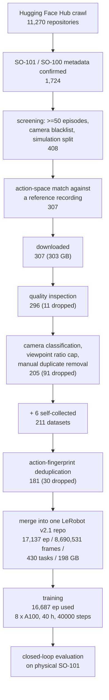

# 01 — Overview

`so101-pi05-base` is a checkpoint of Physical Intelligence's **pi0.5** vision-language-action
model, fully fine-tuned on a unified corpus of public SO-101 / SO-100 single-arm manipulation
data. These documents describe how it was built, in enough detail to repeat the work.

Author: Dongyoon Kim.

## Why

pi0.5 is trained on a broad robot distribution. It does not know the SO-101 specifically: its
six joints and their units, the follower-frame action convention the LeRobot driver writes, the
camera viewpoints people actually mount on this arm. Fine-tuning it directly on a task with a
few dozen demonstrations means spending those demonstrations on learning the robot before
learning the task.

The premise of this work is that the robot-level adaptation can be paid for once, on a large
mixed corpus, and then reused. What is wanted afterwards is a starting point where a
task-specific fine-tune only has to teach the task. The observed outcome is consistent with
that: 14 episodes, out of the 16,687 the run was fed, were enough for a task that then ran
closed-loop on real hardware at an observed success rate of about 90%. The number of trials
behind that rate was not recorded, so it is a qualitative report rather than a measurement.
The failures are not spread evenly: they concentrate on multi-color sequential instructions
("blue, then green, then black"), a form absent from that task's 14 demonstrations.

The corpus was assembled from public Hub datasets rather than collected. Roughly a hundred
people have published SO-101 teleoperation recordings; individually they are small and mutually
incompatible, but the union is large. Most of the engineering here is in making them
loadable as one dataset.

## Result

| | |
|---|---|
| Model | pi0.5, about 3.62B parameters (PaliGemma `gemma_2b` + SigLIP, action expert `gemma_300m`) |
| Base checkpoint | `lerobot/pi05_base` |
| Method | full fine-tune, bf16, no LoRA |
| Action space | 6-DoF, chunk size 50, flow matching |
| Cameras | 3 fixed slots, unused slots masked out |
| Merged corpus | 17,137 episodes / 8,690,531 frames / 430 tasks / 51,411 videos, 198 GB |
| Actually fed to the run | 16,687 episodes / 8,595,621 frames (450 episodes from five 10 fps sources excluded mid-run, see 05 §2) |
| Compute | 8 x A100 80GB SXM4, about 40 hours, 40000/40000 steps, epoch 1.19 over the 8,595,621 frames actually fed (1.178 over the full 8,690,531-frame merge) |
| Throughput | 3.4-3.55 s/step at effective batch 256 |
| Loss | 0.10 -> 0.0065, gradient norm about 0.058, no crashes and no NaN |
| Final weights | `model.safetensors`, 7,481,485,688 bytes |
| Hardware evaluation | step 40000, closed-loop success about 90% on a task with 14 training demonstrations; trial count not recorded |
| Weight license | Gemma Terms of Use (pi0.5 is a Gemma derivative) |
| Code license | Apache-2.0 (VLASH, openpi, LeRobot) |

Twenty checkpoints were archived, every 2000 steps. Only step 40000 has been validated on
hardware; a checkpoint sweep has not been run, and lowest training loss does not imply best
closed-loop behavior.

**Only step 40000 is published.** The other nineteen archived checkpoints are not part of the
release, so the sweep described in 06 §8.4 is available only to someone who has run the training
themselves and still holds their own archive.

## Pipeline



Same funnel as a table, with the reason each stage drops what it drops:

| Stage | In | Out | Dropped by |
|---|---|---|---|
| Hub crawl | - | 11,270 | full-text and tag search over the Hub |
| Robot identification | 11,270 | 1,724 | metadata does not name SO-101 / SO-100 |
| Screening | 1,724 | 408 | fewer than 50 episodes; blacklisted camera types (laptop, phone, webcam, screen capture); `meta/info.json` missing, private or unparseable. Simulation is split off into its own category and labelled, not dropped: 18 of the 408 are simulation |
| Action-space match | 408 | 307 | wrong action dimension, joint names, units; leader-frame recordings; bimanual (12-dim) |
| Download | 307 | 307 | 2 initially failed on transfer encoding, recovered by a git-lfs clone; 303 GB total |
| Quality inspection | 307 | 296 | non-standard schema, 200-degree trajectory jumps, missing video |
| Camera classification | 296 | 205 | front / side viewpoint over-representation capped at 20% of episodes, undecided sources, name-level duplicates |
| Self-collected added | 205 | 211 | - |
| Fingerprint dedup | 211 | 181 | cross-author re-uploads, cumulative supersets, train/val splits of one recording |
| Merge | 181 | 17,137 episodes | 7 episodes dropped (4 empty, 1 truncated, 2 junk); surplus, depth and IR streams dropped |
| Training | 17,137 | 16,687 | 450 episodes from 10 fps sources, excluded mid-run on a timestamp tolerance failure |

Episode counts along the way: 19,858 episodes across the 211 datasets before dedup, 17,137
after dedup and merge, 16,687 in the run.

## Reproduction order

Four documents are stages, in order: 02, 03, 04, 06. Each stage's output is the next stage's
input, and there is no way to skip ahead except by starting from the released dataset, which is
the point of the branch below. 05 is not a stage; it is the companion failure reference, read
alongside 04 and 06.

| # | Document | What it produces | Wall clock | Resources |
|---|---|---|---|---|
| 02 | Dataset construction | 307 downloaded source datasets (303 GB), then one merged LeRobot v2.1 repository of 17,137 episodes (198 GB), then the license-filtered release subset | not recorded; the 303 GB download and the merge are the two long stages, everything else is metadata work | ~1 TB disk, HF account and token, no GPU except for the closing smoke tests. Videos are hardlinked or stream-copied, never re-encoded |
| 03 | Training environment | a container image holding the training stack and four patched files, 53.2 GB | not recorded | Docker, a container registry, network for the base-weight pre-bake. One GPU for the optional forward and single-step checks |
| 04 | Training execution | 20 archived checkpoints, 7.0 GiB each | about 40 h for 40000 steps, plus instance provisioning and the corpus transfer | 8 x A100 80GB (or 8 x H100 80GB), 400 GB instance disk, object storage |
| 06 | Inference and hardware evaluation | closed-loop success numbers on physical hardware | not recorded | a physical SO-101 follower arm, 2 or 3 USB cameras, one inference GPU (an RTX 3090 Ti 24 GB was used) |
| 05 | Troubleshooting | — | — | reference for the nine entries: four training failures plus one on what a smoke test cannot catch, and four on the robot |

**Shortcut.** If the aim is a checkpoint rather than a reproduction of the corpus, start at 03
with the released dataset and skip 02 entirely. That trades several days of collection work for a
smaller, differently-distributed corpus: the release holds 156 of the 181 source datasets and
13,969 of the 17,137 episodes, because 25 sources declare no upstream license and are not
redistributed. A run on the release is a different run, not this one.

**Do not skip the smoke test.** It is specified twice: the container-level end-to-end test in
03 §8.5, and the 20-step run against the real dataset and the real hardware in 04 §3. Three of
the four failures that cost time in this project appeared between step 70 and step 200 of the
full run, not in either smoke test. They still catch the ones that matter for cost: image pull,
multi-GPU discovery, peak memory, and whether checkpoints actually reach object storage. The
last one is silent when it fails.

## What you need

**Compute for training.** 8 x A100 80GB SXM4 with NVLink is what was used. 8 x H100 SXM5 is
equivalent for this workload; both are 80 GB with NVLink. PCIe-attached nodes pay a 10-15%
all-reduce penalty. Peak memory at per-GPU batch 8 was not measured precisely on A100; if a
node runs out, per-GPU batch 4 with gradient accumulation 8 preserves the effective batch of 256
and therefore the learning-rate schedule.

Fewer or smaller GPUs will work but change the schedule. The optimizer settings below assume
effective batch 256 and a cosine schedule baked into 40000 steps; that step count cannot be
extended after the fact.

**Compute for inference.** One GPU. The weights are 7.0 GiB in bf16 and the policy loads a
PaliGemma tokenizer alongside them. The hardware evaluation ran on an RTX 3090 Ti, 24 GB, driver
590.48.01 (06 §1); peak VRAM during that run was not recorded. The same card also ran a forward
pass of this model at batch 2 in bf16, and a single full fine-tune training step at batch 1 with
8-bit AdamW and gradient checkpointing peaked at 21 GB on it.

**Disk.**

| Where | Size |
|---|---|
| Source downloads, 307 datasets with video | 303 GB |
| Working copy before dedup, 211 datasets | 246 GB |
| Unified dataset | 198 GB |
| Container image | 53.2 GB (19.7 GB compressed) |
| Training instance, total | 400 GB minimum (image + corpus + rolling checkpoints ~45 GB + cache) |
| Archived checkpoints, 20 x 7.0 GiB | 140 GiB |

Around 1 TB of local disk covers collection and build with room to work. The training instances
used here shipped with 20-22 TiB of local NVMe, so instance disk was never a constraint; on a
provider where it is, request at least 400 GB.

**Network.** The corpus download to the training instance is the step where geography decides
whether the run happens at all. A host in Japan pulling from a US object-storage region measured
0.87 MiB/s, which makes a 198 GB transfer impossible in practice; a US East Coast host was fine.
Pick a training region close to the bucket, and raise the transfer client's concurrency
(`aws configure set default.s3.max_concurrent_requests 256`) before the sync — the default of 10
is several times slower on a corpus of roughly 68,000 small objects.

**Accounts.**

| For | Why |
|---|---|
| Hugging Face, with a token | Hub crawl at scale, dataset download, gated `google/paligemma-3b-pt-224` tokenizer |
| Cloud GPU provider | 8 x A100 / H100 for about 40 hours. On-demand only; this run has no spot-resume path |
| Object storage (S3 or equivalent) | corpus staging and checkpoint archive. Without it, checkpoints live only on the instance and are lost at termination |
| Container registry | the training image, if not rebuilt on the instance |
| Experiment tracking (optional) | loss, gradient norm and learning-rate curves during the run |

Use a scoped storage credential on the training instance, not an administrative one: read on the
dataset prefix, read/write/delete on the checkpoint prefix, list on the bucket restricted to
those prefixes. The instance is third-party hardware.

## Cost

Measured: 40000 steps at 3.4-3.55 s/step, about 40 hours wall clock on 8 x A100 80GB, on-demand,
single run, no restarts.

What that costs depends entirely on the provider, and this is the weakest-documented part of the
project.

| Item | Value |
|---|---|
| Training wall clock | about 40 h (measured) |
| Provider rate for 8 x A100 80GB on-demand | not pinned down before launch; sources consulted disagreed in the range $1.79-2.79 per GPU-hour, i.e. roughly $14-22/h |
| Derived training cost at that range | roughly $570-890 for 40 h |
| Budget approved for the run | about $1,500 |
| Actual invoiced amount | **not recorded** |
| Same 40 h on a GPU marketplace at $0.87 per GPU-hour | roughly $280, derived, not what was used |
| Object storage and egress | **not recorded** |
| Collection and build stages | no GPU cost; local machine time only |

Two practical notes. Termination is manual and idle time bills at the same rate, so terminate as
soon as the checkpoints are confirmed in object storage. And there is no spot-resume wiring for
the full fine-tune, only model-only checkpoint archiving, so a host failure loses the steps since
the last archive; restarting from an archived checkpoint reinitializes the optimizer and the
learning-rate schedule, which no longer matches the original cosine.

## Document index

| # | Document | Contents |
|---|---|---|
| 01 | this document | project, results, pipeline, order, requirements, cost |
| 02 | `02-dataset-construction.md` | Hub crawl and screening; the action-space conformity check against a reference recording, with leader-frame and bimanual rejection; download; v3.0 to v2.1 conversion; camera-slot mapping and masks; fingerprint deduplication; episode drops and prompt normalization; the merge into one repository; normalization statistics; integrity verification; the license filter for publication; the two data pitfalls that killed training runs |
| 03 | `03-training-environment.md` | container image layers, the four patched files (224 resize-with-pad before collate, per-sample camera masking with mask columns kept out of normalization, a bounded video decoder cache, inference-side guards), base-weight pre-bake, `base.yaml` field by field, the wrapper scripts, build verification |
| 04 | `04-training-execution.md` | instance requirements, data staging, the exact launch command, every hyperparameter as written to `train_config.json`, multi-GPU behavior, checkpointing, monitoring, what the run looked like, and how to verify it finished |
| 05 | `05-troubleshooting.md` | nine problems that actually occurred, with the diagnosis path for each: four in training (file descriptors, 10 fps timestamps, video decoder cache leak, corrupt frames), one on what a smoke test cannot catch, and four on the robot (UVC backend, pixel format, calibration schema, tokenizer path) |
| 06 | `06-inference.md` | robot and camera setup, checkpoint layout, camera backend and calibration pitfalls, every runtime option and its tradeoff, the validated operating configuration, the evaluation procedure, closed-loop results, generalization observations, limitations |

The released model card and dataset card are `model/README.md` and `dataset/README.md`; they
duplicate some of the material here in a form suited to a Hub repository.

## What ships in this repository

The code the documents describe is in the package, so a path in a command below is a real path,
not a placeholder for something to reimplement.

```
docs/                     these six documents
pipeline/                 the dataset-construction scripts of 02, one per stage
  artifacts/              the four JSON instruction sheets the merge is driven by
training-docker/          everything needed to build the training image of 03
  Dockerfile
  patched/                the four patched source files
  configs/base.yaml       the training configuration
  scripts/                the wrapper scripts, train-base first among them
  tests/                  host-side checks that need no GPU
inference/                the two files the evaluation of 06 is driven by
  v4l2_launch.py          launcher that forces the V4L2 camera backend
  eval.yaml               the robot, camera and policy configuration that was evaluated
scripts/                  release-side: repack_open_subset.py, gen_attribution.py,
                          verify_checkpoint.py, and the two JSON inputs they read
                          (repack_plan.json, license_join.json)
model/                    model card, license, notice
dataset/                  dataset card, per-source attribution, license
```

Most pipeline stages take their working directory as `--root` and every one of them prints what
it wrote, so the stages can be run one at a time and inspected between runs. The five that have
no `--root` operate only on files named by other flags; 02 "Before you start" lists them.
